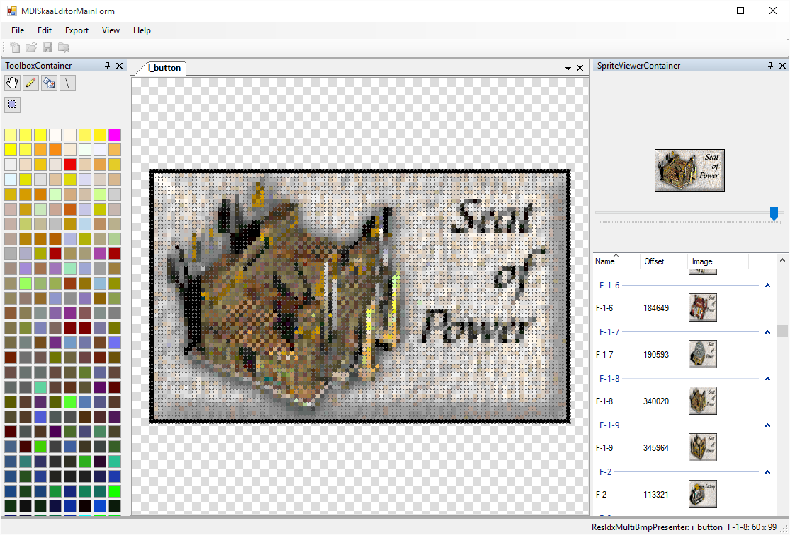

# skaa_editor
SkaaEditor seeks to provide non-technical users (e.g., non-programmers) the ability to re-skin the game to their liking. The project is currently in its infancy and battles a few other projects that vie for my time. 

## getting started
You may download the current alphaV4 release [here](https://github.com/sraboy/skaa_editor/blob/master/other/SkaaEditor_x86_alphav4.zip). Please report bugs here by submitting an issue or by emailing me at [steven[dot]lavoiejr[at]gmail.com](<a href='&#109;&#97;&#105;&#108;&#116;&#111;&#58;&#115;&#116;&#101;&#118;&#101;&#110;&#46;&#108;&#97;&#118;&#111;&#105;&#101;&#106;&#114;&#64;&#103;&#109;&#97;&#105;&#108;&#46;&#99;&#111;&#109;'>&lt;&#111;&#98;&#115;&#99;&#117;&#114;&#101;&#100;&#32;&#039;&#109;&#97;&#105;&#108;&#116;&#111;&#039;&#32;&#108;&#105;&#110;&#107;&gt;</a>).

Please note that SkaaEditor is still in ALPHA, meaning there are plenty of unknown or simply unfixed bugs and not everything may work properly. In addition, there are several UI quirks that have yet to be worked out.

You can open and edit all unit-type sprites (SPR files: ballista.spr, caravan.spr, etc) as well as all *.res files that are essentially sprites, known as ResIdxMultiBmp within SkaaEditor. See [this page](https://www.7kfans.com/wiki/index.php/ResourceFormats#File_Listing) on 7kfans.com's wiki, or [file_types.csv](https://github.com/sraboy/skaa_editor/blob/master/other/working/file_types.csv) in the repo. Please submit an issue here on Github if you encounter an SPR file that does not open properly. 

If you attempt to open any file, *.spr or *.res, before you've opened a palette (pal_std.res), you'll be shown an "Open File" window to select a palette first.

Currently, you can edit SPR files and save them. In order to use them in-game, you must open std.set (File>>Open Game Set, or drag-and-drop it) before editing. You must then also save the game set after saving your sprite. Both of these edited files must be present in 7KAA's data directory (resource and sprite sub-directories) to work. The game set contains information about the offsets of individual frames in the SPR files.

ResIdxMultiBmp files contain their own built-in database so you do not need std.set to edit them. ResIdxMultiBmp files, like i_button.res, can be edited like SPR files. You can also add new frames, for example, to create a new button. 

## status & known issues
- Note that various shades of yellow are the default colors; 7KAA automatically replaces this yellow with the proper nation color while in-game.
- There is currently no undo/redo
- The Standard Game Set (std.set) has database tables in it, and rows are loaded based on the current sprite's SpriteId, which is based on the SPR's filename. These rows contain the offsets of each frame's data in the SPR file. This is how the game does it and likely won't change. Therefore, if you want to actually save your changes for use in the game (which requires updating std.set), your file name must match the original.
- You must save both your sprite (*.spr) and std.set at the same time if you ever want to use that sprite in-game. This is because, once you save your edited sprite, its frames' offsets have changed. The offset is the only way to identify a frame in std.set, so opening an edited sprite with the original std.set means there's no way to identify which edited frame matches which offset in the database. This may be resolved in a future release, allowing the user to identify which is which and/or just allowing the user to re-open the original and copy/paste their edits.

## how to

Launch SkaaEditor. Use the File menu to select an SPR or RES file (of the proper format, see above) or just drag-and-drop whatever files you want to open. For SPR files, also open std.set if you intend to edit them for use in-game (again, see above).

To edit, choose a color from the palette. Right-click will erase pixels by making them transparent. Select colors (only changing the left-click color is currently supported) by choosing them from the palette on the left.

Click on the image, or use the tracking bar, on the "Timeline View" in the top-right to navigate frames. This is how you change the "active frame," the one you're editing. Double-click on the timeline's image to cause it to animate by cycing through all the frames in the sprite; double-click again to stop. Middle-clicking the timeline's image zooms in/out. A single left/right click on the image will navigate forward/backward exactly one frame.

## the future
Eventually, more of the sprite's data will be exposed to the user to allow for editing specific actions, as well as adding new frames for new actions. 

I would like this project to be a suite of tools for developers/enthusiasts to mod and customize the game.

## how to help
Fork the code and take a whack. You can compile the code with Visual Studio 2015 (untested on Mono). Each project within the solution has its own .NET framework target since some are third-party libraries. Changing these targets may introduce undefined behavior and/or new bugs.

Most of the code is commented and/or self-explanatory. You'll likely see a few C++isms where I was following the original game code closely, especially in the SkaaGameDataLib project.

Pull requests should come from a clean branch tracking master. Minimize the number/extent of changes per pull request. Ensure you are really following the source code, and testing your changes, before submitting pull requests.

## credits
Obviously, this project wouldn't be possible without [Enlight Software](http://www.enlight.com/)'s release of the game's source code -- not to mention Trevor Chan's brilliant ideas for this game to begin with. My personal fork of the game, with Visual Studio project/solution files, can be found [here](https://github.com/sraboy/7kaa). 

Thanks to everyone at [7kfans.com/](http://www.7kfans.com/), the new home of Seven Kingdoms and its open source project, for keeping 7KAA awesome and now up-to-date. I'd also like to give a shoutout to [Cyotek](http://www.cyotek.com/) for their awesome [ImageBox control](https://github.com/cyotek/Cyotek.Windows.Forms.ImageBox) and [ColorPicker](https://github.com/cyotek/Cyotek.Windows.Forms.ColorPicker), both of which have been extended for this project's use.

## license
The project is primarily governed by the [MIT license](http://www.opensource.org/licenses/mit-license.php) Game content from 7KAA remains under that project's license, [http://www.7kfans.com/wiki/index.php/Seven_Kingdoms:Copyrights](mostly GPLv3). See the [License Readme](https://github.com/sraboy/skaa_editor/tree/master/other/licenses/_license_readme.md) for details on the license for each component in the project.

The project changed from GPLv3 to MIT on 22-Dec-2015. Please let me know if you notice any incorrect license information, for example, in the source headers.